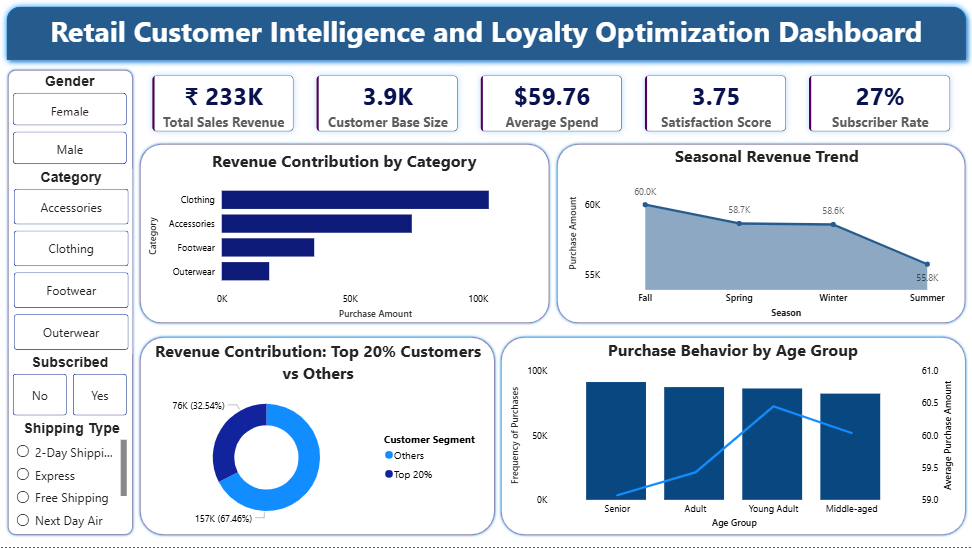
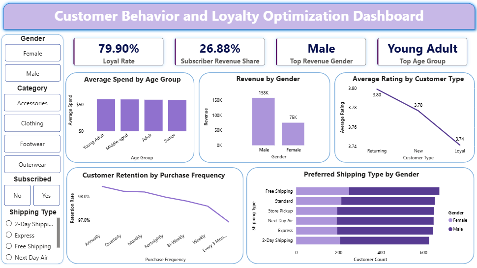
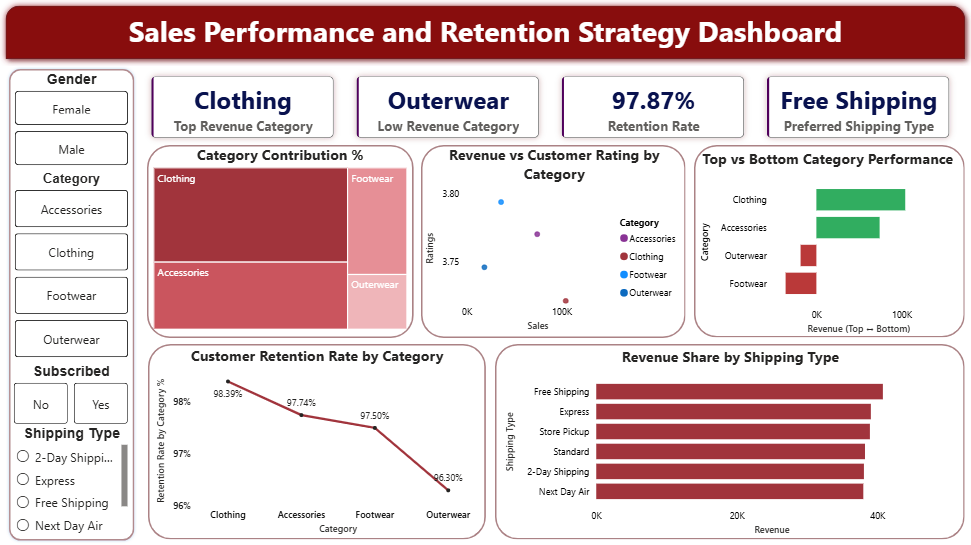

# Retail Customer Intelligence & Loyalty Optimization

---

## 📊 Project Overview

Retail customer analytics project focused on identifying **revenue drivers, customer segmentation patterns, and loyalty behavior** using Python, SQL, and Power BI.

The project combines **data preprocessing, exploratory analysis, business intelligence, and interactive dashboarding** to generate actionable insights for customer retention, category optimization, and sales performance improvement.

---

## 🧩 Business Problem

The retail business experienced:

- Uneven revenue contribution across customer segments  
- Declining repeat purchase behavior and customer retention  
- Inconsistent product category performance  
- Limited visibility into customer loyalty drivers  
- Inefficient discount allocation and promotional strategy  

This project analyzes **customer transaction-level data** to identify behavioral patterns and opportunities for improving **retention, revenue efficiency, and customer segmentation strategy**.

---

## 📂 Dataset Overview

The dataset contains structured retail transaction data, including:

- Customer demographics (Age, Gender, Location)  
- Product attributes (Category, Item Purchased, Season, Color, Size)  
- Purchase behavior (Purchase Amount, Frequency, Previous Purchases)  
- Customer engagement indicators (Review Rating, Subscription Status)  
- Transaction details (Discount Applied, Payment Method, Shipping Type)  

---

## 🛠️ Tools & Technologies

- **Python (Pandas)** – Data cleaning, preprocessing, missing value handling, feature engineering, and exploratory data analysis (EDA)  
- **SQL** – Customer segmentation, revenue analysis, behavioral querying, aggregations, and category performance evaluation  
- **Power BI** – Interactive dashboards, KPI tracking, data visualization, and business performance reporting  
- **Excel / CSV** – Data storage, validation, and intermediate dataset handling  

---

## 🔄 Project Workflow

Raw Dataset → Python Data Cleaning → SQL Business Analysis → Power BI Dashboard Development → Insights Generation

---

## 📈 Key Analysis Highlights

- Customer segmentation based on purchasing behavior and frequency patterns  
- Revenue contribution analysis across customer groups and product categories  
- Loyalty and repeat purchase behavior evaluation  
- Subscription vs non-subscription performance comparison  
- Discount impact analysis on customer purchase behavior  
- Identification of high-performing and underperforming categories  
- Behavioral trend analysis across customer segments  

---

## 📸 Dashboard Snapshots

### Customer Intelligence Overview  

### Customer Behavior Analysis  

### Sales & Retention Strategy  

---

## 💡 Key Insights & Strategic Recommendations

- Top 20% of customers contributed 67.46% of total revenue — indicating high concentration risk and need for retention-focused diversification
- Customer retention rate of 79.7% signals solid repeat engagement, but the 20.3% churn gap represents measurable lost revenue
- Subscription program shows near-zero spend impact ($59.49 vs $59.86 avg. purchase) — incentive structure needs a complete redesign
- Discount allocation is broad rather than targeted — no meaningful concentration toward high-value or churn-risk segments

---

###  Strategic Focus Areas

- Strengthen retention strategies for high-value customer segments  
- Optimize discount allocation to balance revenue and profitability  
- Improve performance of underperforming product categories  
- Expand subscription-based customer engagement strategies  
- Develop targeted campaigns for potential churn-risk customers  

---

## 🚀 How to Run / Explore This Project

1. Run the Python notebook for data cleaning and preprocessing  
2. Import cleaned dataset into SQL environment and execute analytical queries  
3. Open Power BI file (`retail_customer_intelligence_and_loyalty_optimisation_dashboard.pbix`)  
4. Explore dashboards using filters, KPIs, and interactive visuals  

---

## 🔮 Future Enhancements

- Customer churn prediction modeling  
- Customer lifetime value (CLV) estimation  
- Revenue forecasting using time-series models  
- Advanced customer segmentation using clustering techniques  
- Personalized recommendation system development  

---

## 📂 Project Structure

- [README.md](README.md)

- [00_project_overview](00_project_overview/)
  - project_workflow_diagram.png

- [01_data](01_data/)
  - retail_customer_intelligence_raw_dataset.csv
  - retail_customer_intelligence_cleaned.csv

- [02_python](02_python/)
  - data_cleaning.ipynb

- [03_sql](03_sql/)
  - retail_queries.sql

- [04_power_bi](04_power_bi/)
  - retail_customer_intelligence_and_loyalty_optimisation_dashboard.pbix

- [05_dashboard_images](05_dashboard_images/)
  - dashboard_1_overview.png
  - dashboard_2_customer_behaviour.png
  - dashboard_3_sales_performance.png

- [06_project_report](06_project_report/)
  - retail_customer_intelligence_&_loyalty_optimization_report.pdf

---

## 👤 Author & Contact

**Jasmine Bhardwaj**  
Business Analytics | Data Analytics | SQL | Python | Power BI  

- LinkedIn: https://www.linkedin.com/in/jasminebhardwaj31  
- Email: jasminebhardwajofficial@gmail.com  
